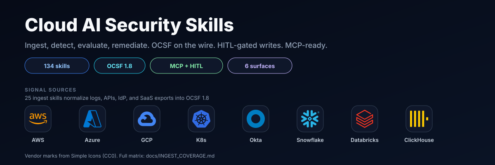
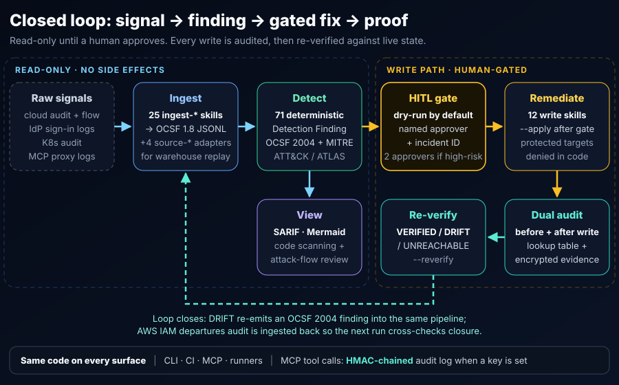
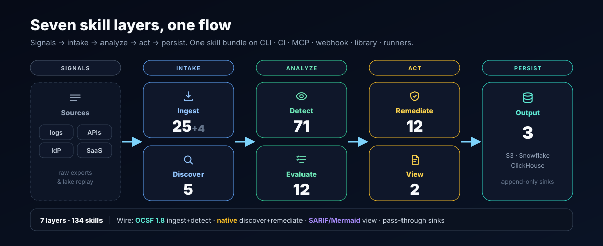
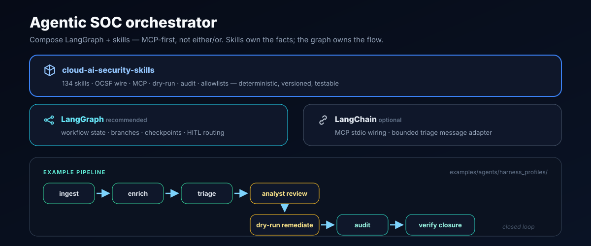
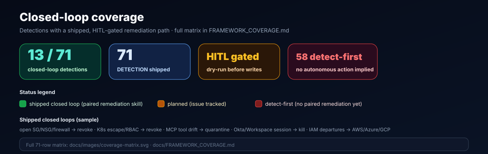

<p align="center">
  <a href="https://github.com/msaad00/cloud-ai-security-skills/actions/workflows/ci.yml?query=branch%3Amain"></a>
  <a href="CHANGELOG.md"></a>
  <a href="LICENSE"></a>
  <a href="https://www.python.org/downloads/"></a>
  <a href="https://schema.ocsf.io/1.8.0"></a>
  <a href="docs/COVERAGE_SNAPSHOT.md"></a>
</p>

<p align="center"><strong>134 deterministic security skills for cloud &amp; AI infrastructure.</strong> Turn raw cloud, identity, Kubernetes, and MCP logs into standard findings, then fix what matters behind a human approval gate — with an audit trail and a re-check that proves the fix held.</p>

## What this is

- **Deterministic skills, not prompts.** Every skill is a small Python bundle (`SKILL.md` + `src/` + `tests/` + `REFERENCES.md`) that reads stdin and writes JSONL. Same input, same finding. Models can orchestrate; they never invent the facts.
- **A real contract on the wire.** Ingest and detect speak [OCSF 1.8](skills/detection-engineering/OCSF_CONTRACT.md); detections are Detection Finding `2004` with MITRE ATT&CK / ATLAS mappings, frozen by golden fixtures so a refactor that changes the shape fails CI.
- **Writes are gated, audited, and re-verified.** Remediation is dry-run by default, needs a named approver and incident ID before `--apply`, audits before and after every write, and re-checks live state. Policy: [`docs/HITL_POLICY.md`](docs/HITL_POLICY.md).
- **One codebase, every surface.** The same skill runs from a shell pipe, CI, an MCP client, a webhook/queue runner, or as a Python library. Wrappers add orchestration, never a second implementation.

## How the loop closes



Details: [`docs/REMEDIATION_VERIFICATION.md`](docs/REMEDIATION_VERIFICATION.md) (VERIFIED / DRIFT / UNREACHABLE) · [`docs/MCP_AUDIT_CONTRACT.md`](docs/MCP_AUDIT_CONTRACT.md) (HMAC-chained MCP audit log) · [`docs/DATA_FLOW.md`](docs/DATA_FLOW.md).

## Quickstart

No cloud credentials needed — the demo replays a captured CloudTrail fixture.

```bash
git clone https://github.com/msaad00/cloud-ai-security-skills.git
cd cloud-ai-security-skills
uv sync                      # install uv first: https://docs.astral.sh/uv/
uv run make demo             # ingest -> detect -> SARIF, then prints the findings
```

Expected stdout tail (structured JSON logs go to stderr; `<rule id>` is the SARIF rule):

```text
Findings written to /tmp/cloud-security-demo.sarif
1 finding(s) emitted
  - <rule id>: AWS IAM access key created

Actor `AROAEXAMPLEID:alice` successfully called `CreateAccessKey` for IAM user `bob` in account `123456789012` (us-east-1). Source IP: 203.0.113.42. This creates additional AWS credential material for a valid cloud account.
```

The same pipeline, spelled out — each stage is a standalone skill joined by a Unix pipe:

```bash
uv run python skills/ingestion/ingest-cloudtrail-ocsf/src/ingest.py \
       skills/detection-engineering/golden/cloudtrail_raw_sample.jsonl \
  | uv run python skills/detection/detect-aws-access-key-creation/src/detect.py \
  | uv run python skills/view/convert-ocsf-to-sarif/src/convert.py \
  > findings.sarif
```

Drop the last stage to see the raw OCSF Detection Finding. More paths: [`docs/QUICKSTART.md`](docs/QUICKSTART.md) · cloud SDK groups: [`docs/INSTALL.md`](docs/INSTALL.md).

| Need | Read |
|---|---|
| Pick a skill | [`docs/SKILL_INDEX.md`](docs/SKILL_INDEX.md) |
| Wire an agent (MCP) | [`docs/AGENT_QUICKSTART.md`](docs/AGENT_QUICKSTART.md) |
| Ship a SOC workflow | [`docs/HARNESS.md`](docs/HARNESS.md) |
| Map to frameworks | [`docs/FRAMEWORK_COVERAGE.md`](docs/FRAMEWORK_COVERAGE.md) |
| Browse every doc | [`docs/README.md`](docs/README.md) |

## Skills at a glance

| Layer | Count | Output |
|---|---:|---|
| Ingest | 25 | OCSF 1.8 |
| Discover | 5 | native / bridge JSON |
| Detect | 71 | OCSF Detection Finding 2004 |
| Evaluate | 12 | compliance result |
| Remediate | 12 | audited action trail |
| View | 2 | SARIF · Mermaid |
| Output | 3 | S3 · Snowflake · ClickHouse |
| Sources | 4 | warehouse query adapters |

**134 shipped skills.** Live counts: [`docs/COVERAGE_SNAPSHOT.md`](docs/COVERAGE_SNAPSHOT.md). Vendor ingest matrix: [`docs/INGEST_COVERAGE.md`](docs/INGEST_COVERAGE.md). Why not roll your own: [`docs/WHY.md`](docs/WHY.md).

## Architecture

Signals flow intake → analyze → act → persist. Every surface calls the same skill bundle.



Deeper reads: [`docs/ARCHITECTURE.md`](docs/ARCHITECTURE.md) · [`docs/SKILL_CONTRACT.md`](docs/SKILL_CONTRACT.md) · [`docs/diagrams/`](docs/diagrams/)

**Invariant:** skills own facts, schemas, mappings, confidence, and audit. Orchestrators own workflow state and model choice only.

## Design decisions

Full rationale: [`docs/DESIGN_DECISIONS.md`](docs/DESIGN_DECISIONS.md) and the eleven-principle [`SECURITY_BAR.md`](SECURITY_BAR.md).

- **Side effects live at the edges.** Only `source-*` (read external systems), `remediate-*` (write to cloud/identity), and `sink-*` (write to storage) touch the outside world. Everything else is a pure stdin → stdout transform.
- **OCSF for streams, native for operations.** Findings use OCSF so SIEMs ingest them unchanged; inventory, AI BOM, and remediation audit stay native because they are not event streams. [`docs/NATIVE_VS_OCSF.md`](docs/NATIVE_VS_OCSF.md)
- **Approval scales with blast radius.** Single-user session kills need one approver and an incident window; MCP tool quarantine and Kubernetes node drain need two. Protected namespaces and principals are denied in code, not just config. [`docs/HITL_POLICY.md`](docs/HITL_POLICY.md)
- **Least privilege is linted.** `scripts/validate_safe_skill_bar.py` fails CI on wildcard IAM without justification and on any `sts:AssumeRole` allow without an org/account boundary condition.
- **Agentless and quiet.** No daemons, no telemetry, no undeclared egress; official vendor SDKs, with any exception documented. [`docs/THREAT_MODEL.md`](docs/THREAT_MODEL.md)
- **Idempotent, replay-safe persistence.** Deterministic identifiers plus append-only or merge-safe sinks mean queue retries and reruns converge. [`docs/SINK_CONTRACT.md`](docs/SINK_CONTRACT.md)

## Quality gates

Every PR to `main` runs these in CI ([`.github/workflows/ci.yml`](.github/workflows/ci.yml), [`docs/TESTING.md`](docs/TESTING.md)):

- **3,500+ test functions** across ~200 test files — per-skill unit tests, golden-fixture contract tests, integration, and MCP server tests, with per-layer coverage floors.
- **21 repo validators** in `make validate` — skill contract and structure, HITL/safe-skill bar, framework mapping depth, OCSF metadata, remediation infra stubs, doc-count drift, secret literals — plus 3 generated-doc freshness checks in `make docs-check`.
- **Frozen wire format** — 165 OCSF events across 76 golden fixtures and 40 end-to-end golden pipes.
- **Static and supply chain** — `ruff`, `mypy`, `bandit`, `uv lock --check`, IaC linting, and a signed CycloneDX SBOM.

## Agent and MCP integrations

| Client | Doc |
|---|---|
| Claude Code | [`.mcp.json`](.mcp.json) |
| Claude Desktop · Cursor · Windsurf · Codex · Cortex · Zed | [`docs/integrations/`](docs/integrations/) |
| Agent SDK · LangGraph harness | [`examples/agents/`](examples/agents/) |
| Webhook receiver | [`runners/webhook-receiver/`](runners/webhook-receiver/) |
| Python library | [`skills/_shared/library.py`](skills/_shared/library.py) |

Presets: [`presets/`](presets/) · workflows: [`examples/workflows/`](examples/workflows/)

<details>
<summary><b>Workflow frameworks (LangGraph / LangChain)</b> — compose, don't replace</summary>

LangGraph owns multi-step workflow state, checkpoints, and HITL interrupts; this repo owns the facts, mappings, approval gates, and audit. MCP is the tool surface between them. The reference harness ([`langgraph_security_graph.py`](examples/agents/langgraph_security_graph.py), [`harness_profiles/`](examples/agents/harness_profiles/)) runs ingest → enrich → triage → analyst review → dry-run remediate → audit → verify closure. LangChain is optional glue ([`langchain_mcp_security_agent.py`](examples/agents/langchain_mcp_security_agent.py), [`harness_adapters.py`](examples/agents/harness_adapters.py)); wrapping skills as LCEL tools is a documented anti-pattern ([`examples/agents/README.md`](examples/agents/README.md)). Full guide: [`docs/HARNESS.md`](docs/HARNESS.md).



</details>

## Data lakes

Closed-loop lake packs for operator-owned warehouses:

- **ClickHouse** — [`docs/CLICKHOUSE_DATA_LAKE.md`](docs/CLICKHOUSE_DATA_LAKE.md) · [`packs/clickhouse/`](packs/clickhouse/)
- **Snowflake** — [`docs/SNOWFLAKE_DATA_LAKE.md`](docs/SNOWFLAKE_DATA_LAKE.md) · [`packs/snowflake/`](packs/snowflake/)

Write with `sink-*-jsonl`, replay with `source-*-query`, audit rows land back through the same sink.

## Trust · compliance · more

| Topic | Doc |
|---|---|
| Trust posture | [`SECURITY.md`](SECURITY.md) · [`SECURITY_BAR.md`](SECURITY_BAR.md) |
| MCP audit contract | [`docs/MCP_AUDIT_CONTRACT.md`](docs/MCP_AUDIT_CONTRACT.md) |
| Framework mappings | [`docs/FRAMEWORK_MAPPINGS.md`](docs/FRAMEWORK_MAPPINGS.md) |
| Security grades | [`docs/SECURITY_GRADES.md`](docs/SECURITY_GRADES.md) |
| Install | [`docs/INSTALL.md`](docs/INSTALL.md) |
| Supply chain | [`docs/SUPPLY_CHAIN.md`](docs/SUPPLY_CHAIN.md) |

<details>
<summary><b>Closed-loop coverage</b> — detections with paired remediation</summary>



Full per-skill matrix: [`docs/FRAMEWORK_COVERAGE.md`](docs/FRAMEWORK_COVERAGE.md) · [`docs/images/coverage-matrix.svg`](docs/images/coverage-matrix.svg)

</details>

<details>
<summary><b>Layer output formats</b> — when OCSF vs native</summary>

| Layer | Default | Why |
|---|---|---|
| Ingest · Detect | OCSF 1.8 | SIEM interop |
| Evaluate | native | ops dashboards |
| Discover | native / CycloneDX | not an event stream |
| Remediate | native | state + audit trail |
| View | SARIF / Mermaid | human review |
| Output | pass-through | producer format |

</details>

## Roadmap · contributing

Roadmap: [`docs/ROADMAP.md`](docs/ROADMAP.md) · issues [#253](../../issues/253) · [#254](../../issues/254) · [#255](../../issues/255). PRs: [`CONTRIBUTING.md`](CONTRIBUTING.md). Apache 2.0.

Companion scanner: [`agent-bom`](https://github.com/msaad00/agent-bom).
